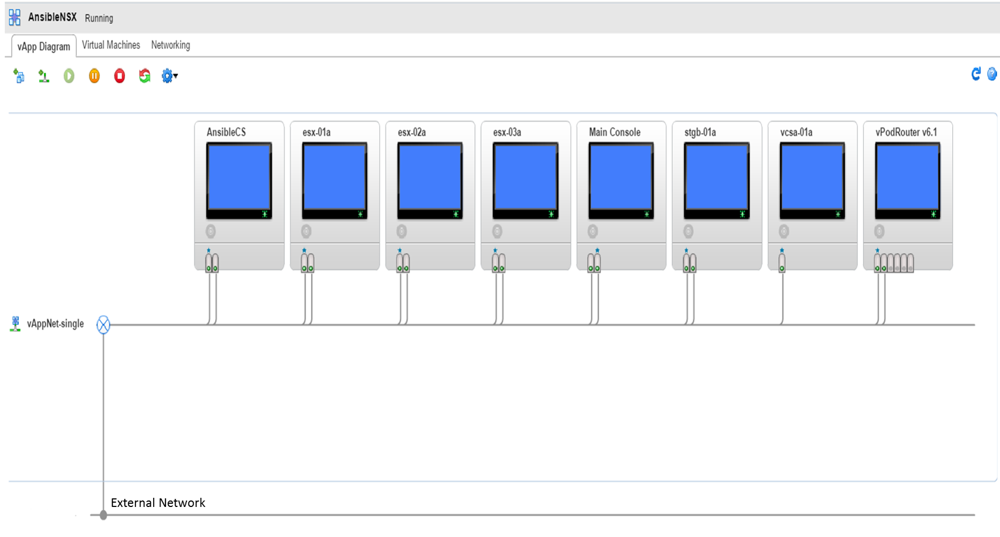

# Lab Toplogy Review

-  Notes:
  - The lab used to develop the excercises in this course will be referred to as the "Reference Lab" throughout the course materials
  - The reference lab was built in a nested virtualization environment, which provides a layer of virtual machines that are functionally equivalent to physical machines. For example, the reference lab uses virtual machines with ESXi installed, allowind an additional layer of virtual machines to be installed on the virtual ESXi host. This lab will refer to this layer as the "virtual-physical layer". Any simulated physical servers in this layer will be referred to as "virtual-physical hosts". Any users building this lab in a physical environment can consider the virtual-physical layer to be equivalent to how you would construct the physical layer in a purely physical environment.

## Software Requirements

The following software is required to complete the lab exercises in this course. This course provides no access to any software, all users of this course are expected to provide their own licensed access to software and are responsible for ensuring their own compliance with licensing rules for the software.

Please Note that while the VMware Ansible Playbooks can be configured to work across a variety of different software versions, the specific versions of software listed here were used during the development of this course and are recommended to ensure the smoothest possible experience following the lab excercises.

### Mandatory Software:
-  VMware vCenter Server 6.0 & Platform Services Controller
  - The reference lab was developed using VMware vCenter Server Appliance 6.0.0.20000 with an embedded Platform Services Controller.
  - Other vCenter versions and form factors may also work, but the above version is the only one that has been tested for the lab excercises.
- VMware ESXi 6.0.0
  - The specific release used in developing this course was VMKernel Release Build 3620759
- VMWare NSX Manager 6.2.5
  - Earlier versions of NSX should also work, but were not tested during the development of this course.
  - Ansible 2.0.0.2 (and required dependencies)
  - Ansible NSX Module (and required dependencies)

### Optional Software:
The following software provides services that are required for the lab excercises, but can be replaced by other software that provides equivalent capabilities if desired. This lab only provides instruction on the software listed below, if users choose to use alternate software, no instructions are provided on setup or configuration.
-  Ubuntu 16_04 Server
  - Used as the Ansible Control Server, Should be fine to use other Linux Distributions
- FreeNAS 9.3
  - Used to provide iSCSI services to provide storage back-end for vCenter Shared Storage. The lab excercises only interact with the vCenter shared storage front end, and do not directly interact with any back-end storage services. While the excercises do require shared storage, any supported mechanism to provide shared storage to vCenter environments should work fine. If you need to minimize lab hardware requirements, per the recommendations below you should be able to conduct the lab excercises with a single physical or virtual ESXi host in the lab environment, which would eliminate the shared storage requirement.
-  Windows Server 2012
  -  In the lab excercises, Windows Server is used for several services:
    -  Active Directory & DNS Services
    -  IIS Services are used only to transfer the NSX Manager OVA file to the Ansible server. Any method of your choice can be used to transfer the file, none of the excercises depend on the method used so long as the file is present on the Ansible Control Server.
    -  Jump Host: I used a remotely accessed lab to develop the excercises, so I use a Windows Server in the lab as a jump host for accessing and testing connectivity to privately-addressed elements within the lab environment. Depending on how you setup your lab environment, you may not need a jump host. You will at minimum need IP connectivity to the labs vCenter server to access the vcenter web client, and need SSH access into the Ansible Server from the terminal you do the excercises on.

## Hardware (or virtual hardware) Requirements
The reference lab was built using nested virtualization, meaning the underlying physical server uses the ESXi Hypervisor, and on top of that hypervisor, virtual machines are installed with ESXi Hypervisor, which enables an additional layer of virtual machines to be installed on the virtual ESXi hosts.

While the reference lab was built with nested virtualization, it is possible to build functionally equivalent lab with physical servers or with standard virtualization. Keep in mind these alternatives may require the user to make adjustments to the lab excercises as this course only provides detailed instruction for the same environment in which it was developed.

A key difference with nested virtualization is that the virtual ESXi hosts become a functional equivalents of physical servers, yet retain the ease of management of VM's along with the ability to use virtualization to significantly minimize hardware requirements. For example, this lab uses the functional equivalent of 8 physical servers, yet because they are virtual machines, they are all running on a single physical server.

#### Nested Lab Considerations
If you are building your lab using nested virtualization, you will need a single physical server with enough hardware capacity to provision virtual machines that match the virtual ESXi host hardware configurations provided below. While specific instructions to install/configure nested virtualization are outside of the scope of this course, there are many blogs and articles on the internet the explain how to set it up.

#### Standard Virtual Lab Considerations
If you are building your lab with standard virtualization, keep in mind you will need an isolated vcenter environment as you should not attempt to do these labs on a production vCenter environment. You can however use ESXi to virtualize a physical server and then install vCenter as a virtual machine and set it up to manage the same ESXi host it is running on. The instructions in this lab will need be adjusted to support a Standard Virtual Lab environment, but it should be pretty straightforward to adapt.

#### Physical Lab Considerations
If you are building a lab using physical servers, provision a physical server to act as a funcitonal equivalent of each of the virtual esxi hosts listed below, with equal or greater hardware provisioned.

#### Minimizing Lab Hardware/Virtual Hardware requirements
Whether you are building a physical or a nested virtualization lab, it should be possible to reduce the amount of servers used in the lab if you need to minimize hardware requirements.

For example, the base lab topology uses 3 ESXi servers, but you could complete all the current lab excercises with a single ESXi physical or virtual host in the lab environment, although you would need to make any needed adjustments yourself.

Similarly you could examine the lab software requirements and attempt to reduce the virtual hardware resources. This lab environment is small and only uses few virtual machines, so software like NSX and vCenter should be very minimally taxed and could likely have hardware resources reduced and still function adequately for the excercises.

### Lab ESXi Host Requirements
The following image is a screenshot of the nested virtualization reference lab built with vCloud director. While the servers shown in the image are virtual machines, they are setup as functional equivalents of physical servers. This image represents what is in effect the actual _physical_ topology of the lab, at least from the perspective of the software you install and configure in the lab. If you are building a physical lab, build your physical topology as shown in the image and use a single physical server for each of the hosts shown in the image. If you are building a nested virtualization lab, just set it up exactly like shown in the image.

The following list provides details of the hardware configuration used for each of the virtual ESXi hosts in the reference lab:

-  AnsibleCS Server
  -  Operating System: Ubuntu 16.04 LTS Server
  -  CPU: 2 Virtual CPU's, one core per CPU
  -  Memory: 4 GB
  -  Hard Drive: 64 GB
  -  NIC: 2 Standard Ethernet NICs
- esx-01a
  -  Operating System: VMware ESXi 6.0.0
  -  CPU: 4 Virtual CPU's, one core per CPU
  -  Memory: 32 GB (While untested for course excercises, 16GB should work fine)
  -  Hard Drive: 2 GB
  -  NIC: 2 Standard Ethernet NICs
- esx-02a
  -  Operating System: VMware ESXi 6.0.0
  -  CPU: 4 Virtual CPU's, one core per CPU
  -  Memory: 32 GB (While untested for course excercises, 16GB should work fine)
  -  Hard Drive: 2 GB
  -  NIC: 2 Standard Ethernet NICs
- esx-03a
  -  Operating System: VMware ESXi 6.0.0
  -  CPU: 4 Virtual CPU's, one core per CPU
  -  Memory: 8 GB
  -  Hard Drive: 2 GB
  -  NIC: 2 Standard Ethernet NICs
- Main Console
  -  Operating System: Windows Server 2012 R2
  -  CPU: 1 Virtual CPU, one core
  -  Memory: 2 GB
  -  Hard Drive: 25 GB
  -  NIC: 2 Standard Ethernet NICs
- stgb-01a
  -  Operating System:
    - I am not sure what Linux Distribution is used as this was a prebuilt VM from my service catalog and has SSH access locked down. This server runs FreeNAS 9.3 so any OS that can support that should work. This course provides no setup instructions for FreeNAS so it may be a good idea to use any storage server you are comfortable with, it can use any storage protocols that are supported to provide vSphere Shared Storage. The only requirement for the lab excercises is that a vSphere shared datastore of adequate size is available in the lab vCenter environment.
  -  CPU: 1 Virtual CPU's, one core
  -  Memory: 5 GB
  -  Hard Drive - 6 Drives provisioned per below:
    - Disk 0: 8 GB
    - Disks 1-5: 20GB Each
  -  NIC: 2 Standard Ethernet NICs
- vcsa-01a
  -  Operating System: VMware vCenter Server Appliance 6.0.0.20000 with embedded Platform Services Controller
  -  CPU: 4 Virtual CPU's, one core per CPU
  -  Memory: 8 GB
  -  Hard Drive - 11 Drives Provisioned per below ... if using VCSA to provide vCenter services, you should just be able to follow the standard installation procedure rather than seeking to replicate this hardware config manually.
    -  Disk 0: 12 GB
    -  Disk 1: 1460 MB
    -  Disks 2-3: 25 GB
    -  Disks 4,5,7 & 9: 10 GB
    -  Disks 6 & 10: 5 GB
    -  Disk 8: 1 GB
  -  NIC: 1 Standard Ethernet NICs
- vPodRouter v6.1
  -  Operating System: Debian 4.6.3
  - __Note:__ The vPod router is used to provide basic routing between the simulated physical subnets in the lab. For example, each ESXi host in the lab has seperate VMkernel adapters with seperate IP addresses and subnets for ESXi Management, Storage and vMotion. The vPodRouter is configured to provide basic default gateway and routing between these subnets. Even in cases where routing is not needed between these subnets (e.g. there is no need to route between vMotion/mgmt/vsan subnets), I recommend allowing routing between all physical subnets for the sake of simplicity.
  - __ANY__ device or software that can provide routing between these subnets can be used in this lab. I recommend using whatever routing software you are most comfortable with to provision routing services.
  - If you are wondering why NSX is not used for these routing needs, it is because these subnets represent the physical environment, and NSX is used primarily to provide networking services for virtual machines within the vCenter environment. In any NSX implementation, physical vlans/subnets are still used and require routing services external to NSX. Because the reference lab is using nested virtualization, the lab uses a software router for these services, but if you build a physical lab, it may make more sense to use a physical router or L3 Switch.
  - Detailed setup instructions for routing services are not provided, to reconstruct the lab you simply need to reference the IP addresses and subnets listed in Lab-1b and ensure each are provided with a default gateway that enables routing between the subnets. For this lab you can enable full routing between all physical subnets without any restrictions.
  -  CPU: 1 Virtual CPU, one core
  -  Memory: 2 GB
  -  Hard Drive: 25 GB
  -  NIC: 2 Standard Ethernet NICs

## Topology & Networking considerations
If you look at the Nested Virtual-Physical Topology image in the "Lab ESXi Host Requirements" section above, you will see that all of the virtual-physical hosts are connected to a single network segment.

This may seem strange at first as it is different from how networking is configured in production environments where seperate VLANs are provisioned for each subnet. While VLAN segmentation has many benefits, using a single flat vlan or network segment can greatly simplify setup requirements for lab environments. If you configure hosts in different IP subnets to use the same VLAN, each of the hosts on that network will function just as if you had created VLANS for each subnet, but without the need to setup the VLANS. This would not be advised for production environments or for certain types of testing, however for training and feature testing this method is very effective at simplifying lab setup. If you prefer, you can setup seperate vlans or network segments for each subnet, as long as routing services are fully configured where needed the lab exercises should work fine.

To replicate the virtual-physical network environment, simply connect each virtual-physical host nic into a single common network segment or vlan. Different subnets will use this common segment. IP addressing and configuration will be provided in Lab-1b.

## [Click here to proceed to the next lab](/Lab1b-BaseSoftwareConfig)
