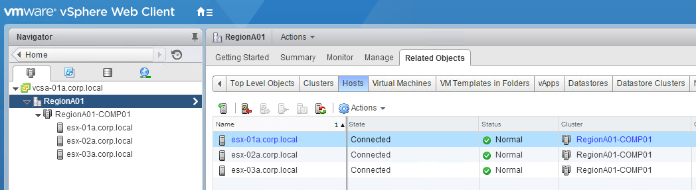
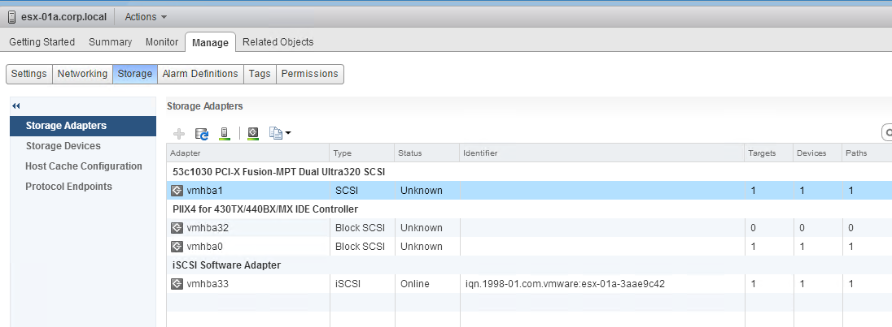
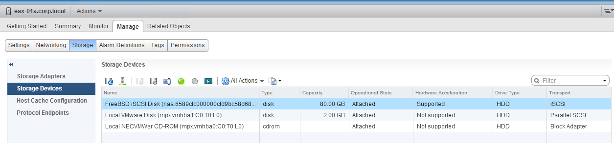
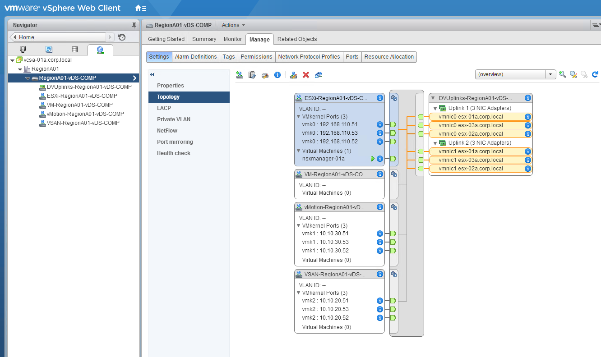
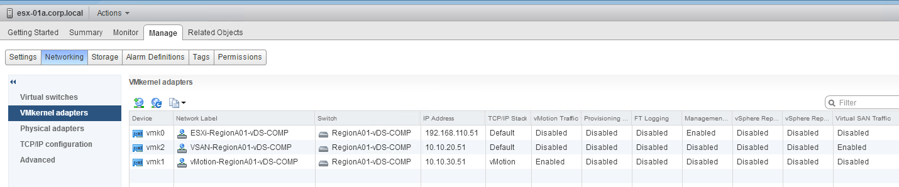

# Base lab software configuration
This section provides configuration information for the base lab software. The primary focus on this course is to provide instruction on the usage of Ansible NSX Modules to install and configure VMware NSX. Before excercises can begin focusing on NSX Ansible Modules, you must build and configure the base lab. This course does not provide detailed setup instructions for the base lab components, but will provide sufficient configuration details to enable you to replicate the lab environment.

__Before proceeding with this section, you should complete lab 1a and have your virtual-physical or physical hosts connected and powered on__

## Base IP Addressing

### IP Addressing by Host

-  ESXi-01a
  -  Management: 192.168.110.51/24
  -  Storage: 10.10.20.51/24
  -  vMotion: 10.10.30.51/24
-  ESXi-02a
  -  Management: 192.168.110.52/24
  -  Storage: 10.10.20.52/24
  -  vMotion: 10.10.30.52/24
-  ESXi-03a
  -  Management: 192.168.110.53/24
  -  Storage: 10.10.20.53/24
  -  vMotion: 10.10.30.53/24
-  Main Console/Windows Server
  -  Primary NIC: 192.168.110.10/24
  -  Secondary NIC: 192.168.0.201/24
    - The reference lab uses the primary NIC for local lab access and the secondary NIC for Internet Access. If your lab allows you to configure the primary NIC to provide both local and internet access, you do not need the secondary interface
-  stgb-01a (iSCSI Server)
  -  Management: 192.168.110.60/24
  -  iSCSI Services: 10.10.20.60/24
-  vCSA-01a
  -  Management: 192.168.110.22/24
-  AnsibleCS
  -  Primary NIC: 192.168.0.202/24
  -  Secondary NIC: 192.168.110.202/24
    - The reference lab uses the secondary NIC for local lab access and the primary NIC for Internet Access. If your lab allows you to configure the primary NIC to provide both local and internet access, you do not need the secondary interface. If you do not need a secondary NIC, you should use the 192.168.110.202 address as it is located on the vSphere Management Network.
-  vPodRouter
-  Eth0: 192.168.0.2/24
-  Eth1: 192.168.110.1/24
  - The configuration of the vPodRouter in the reference lab includes several configuration settings unique to its environment that are not needed in your lab. For this reason the actual IP Configuration is not shared, instead below please find a reference IP configuration including the needed settings to complete the exercises in the course.
  - The Reference lab uses the vPodRouter to provide routing services for local addressing within the lab, and it also has a seperate edge router to provide routing and NAT services from the lab to the global/public network. The Edge router is located at 192.168.0.1, so on this network the vPodRouter uses the address 192.168.0.2. Each of the virtual-physical layer hosts has a management IP on the 192.168.110 network and use the vpod routers 192.168.110.1 as their gateway.
  - The reason the reference lab uses 2 seperate routers is due to its environment. It is definitely possible to use a single router for this purpose which could enable you to consolidate the IP Addressing scheme. The Playbooks used in later lab exercises reference the 192.168.110 network, host interfaces on the 192.168.0 network is used for internet and external network access and are not directly addressed in the playbook exercises.

## Base Windows Server Configuration
Windows Server is installed with basic Active Directory and DNS services which are configured for the `corp.local` Users are free to use any domain they prefer but will need to adjust any lab exercises by replacing references to `corp.local` with whatever domain name is used in their lab.

1.  Install Windows Server 2012 R2
2.  Configure server to be primary domain controller for the `corp.local` domain.
3.  Configure DNS servers, ensure to include forwarders as needed to enable DNS resolution for both local and public internet name resolutions.
4. Create A Records for each of the virtual-physical layer hosts

## Base ESXi Host Configuration
For this lab, ESXi was installed with only basic configuration sufficient to connect to vCenter. You will need to complete these instructions for each ESXi host used in your lab environment.

1.  Install ESXi
  - You will be prompted for a password. The reference lab uses `VMware1!` for all passwords.
2. Connect to the ESXi terminal and configure the hostname and IP Address for the management network
3. Additional ESXi Configuration will be done after vCenter setup. Additional setup tasks will be provided below in the Base vCenter Server Configuration section.

## Base vCenter Server Configuration

1.  Begin the vcsa setup installer.
  -  The following installation variables were used in the reference lab - for any variable not listed here, fill in the appropriate setting for your environment:
    -  FQDN: `vcsa-01a.corp.local`
    -  Username: `Administrator@vsphere.local`
    -  Password: `VMware1!`
    -  Appliance Name: `vcsa-01a`
    -  OS user name: `root`
    -  OS Password: `VMware1!`
    -  Install vCenter Server with an Embedded Platform Services Controller
    -  Create a new SSO Domain
    -  vCenter SSO username: `administrator`
    -  vCenter SSO Password `VMware1!`
    -  SSO Domain Name: `vsphere.local`
    -  SSO Site Name: `Lab`
    -  Select Appliance Size: `Tiny`
    -  Use an embedded database
    -  Network Address: `192.168.110.22`
    -  Subnet Mask: `255.255.255.0`
    -  Default Gateway: `192.168.110.1`
    -  NTP - it is recommended you use NTP to synchronize time between all elements used in the lab. Installation and configuration of NTP are outside the scope of this course.
    -  Enable SSH: `True`
2. Configure VCSA for Active Directory Integrated Windows Authentication for the corp.local domain and ensure the Administrator@corp.local is added to the Administrators group in vCenter
3. Shared Datastore Requirements:
  -  1x 60 GB NFS
  - Mount point: 10.10.20.60:/mnt/NFSA
4. The following screen shots provide additional details needed for the base vCenter configuration. Step-by-step instructions are not provided, to replicate the base vCenter configuration ensure that you vCenter configuration settings match those shown in the screen shots:

## Base Ansible Control Server Configuration
The base lab includes a standard Ubuntu 16.04 Server, freshly installed with OpenSSH server. The only configuration done was basic network addressing. The Ubuntu server should have full IP reachability to the other virtual-physical layer hosts in the lab environment and public internet access. Ansible installation & Configuration is included in Lab-1d.

The IP addressing and Routing configuration for the reference lab has some settings that are specific to VMware's internal vCloud Director environment and may not be needed in other labs. For those using vCloud director, these additional settings are covered in Lab-1c.

## [Click here to proceed to the next lab]()
