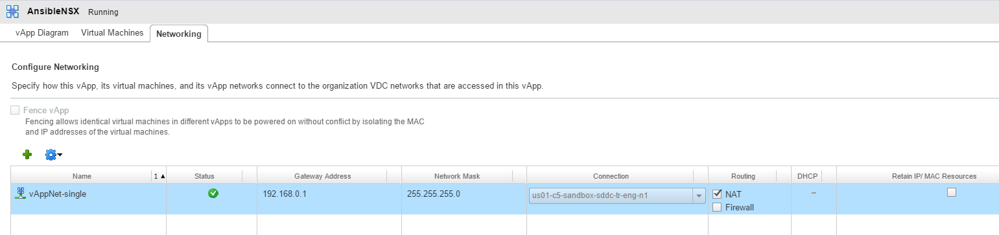
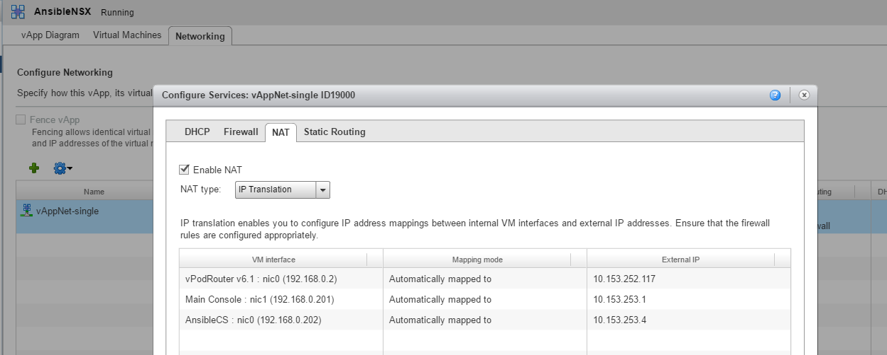

## vCloud Director additional configuration
The reference lab used for exercises in this course was built in the VMware OneCloud environment, which is a VMware internal (employee-only) vCloud Director implementation. This environment includes additional configuration settings that may not be relevant in other lab environments. These additional settings will be covered in this section. This section is based on VMware's internal vCloud Director environment which may be very different from other vCloud director implementations, accordingly, this section is for reference only.

None of the configuration settings in this section are required to complete the lab exercises in this course, even for vCloud Director users. All the details needed to create an equivalent lab environment are covered in Lab-1a and Lab-1b.
The point of this section is to ensure that IP and routing configuration used on the Main Console and AnsibleCS servers to enable both local and internet access from those hosts, remote desktop service from external networks into the Main Console, and SSH access from external networks into the AnsibleCS Server. If your lab includes IP reachability as described, it should not matter exactly how you configured your environment to provide these services.

This section does not include instructions on creating the vApp Template used for the reference lab as all needed details to build the vApp are included in Lab-1a and Lab-1B.

__Note:__ If you cannot setup direct IP access from your terminal to the Windows or Ansible servers, you can use the remote terminal access provided by vCloud director. The only inbound NAT services used in the reference lab are for remote access. The Ansible and Windows servers will need internet access to download required files and software, however this can be done with standard PAT and would not require an inbound NAT service or an externally routeable IP Address. If you are configuring your lab in accordance with this note, you may skip this section and simply ensure that the Ansible and Windows servers have outbound internet access.

As shown in the above image, each of the hosts in the virtual-physical layer is connected to a single network segment named "vAppNet-single". In the image, the small blue circle with an X in it located directly to the right of "vAppNet Single", represents an edge gatway service provided by vCloud director.

1. After creation of the vApp template, ensure the vAppNet-single network is connected to an external network with NAT enabled and firewall services disabled, as shown in the following image:
  -  
2. NAT should be configured to enable PAT addressing for any internal host accessing external networks(enabled by default when you turn on NAT), and configured to provide a one-to-one NAT to enable the Main Console and AnsibleCS servers to be reached from external networks, as shown in the image below:
  -  
3. On the AnsibleCS server:
  -  The AnsibleCS server is configured with a NIC on the 192.168.0.0/24 network to enable NAT translation and external (inbound) network access, and with a 192.168.110.0/24 network address for packet forwarding within the local lab environment.
  -  Configure both Ethernet Interfaces according to the IP Addresses provided in Lab-1B, using the Main Console/Windows Server as the DNS Server. Use the edge gateway router (192.168.0.1) as the default gateway.
  -  __Note:__ Ensure the Windows (or other) DNS server is configured with A Records for the hosts in the virtual-physical layer of the lab, and configured with forwarders to enable global address resolution.
  -  The reference lab includes an additional route to 192.168.0.0/24
4. On the Main Console/Windows Server
  -  The Main Console server is configured with a NIC on the 192.168.0.0/24 network to enable NAT translation and external (inbound) network access, and with a 192.168.110.0/24 network address for packet forwarding within the local lab environment.
  -  Configure both Ethernet Interfaces according to the IP Addresses provided in Lab-1B, using localhost (127.0.0.1) as the DNS Server. Use the edge gateway router (192.168.0.1) as the default gateway.
    - Double Check the Windows Server routing table. Sometimes when Windows boots with 2 NICs it can define 2 default gateways or the incorrect default gateway, and changing the default gateway settings in the Windows gui does not always remove them from the routing table so it may be necessary to manually edit the host routing table.
5. For Both AnsibleCS and Windows Servers:
  -  For the exercises in this course, all hosts in the virtual-physical layer have a management IP on the 192.168.110.0/24 network. Since each host has a direct connection to this network, no additional host routes are needed.
6. For hosts other than the Ansible and Windows Server:
  -  The Ansible and Windows server have multiple nics so they can recieve inbound connections from external networks. Accordingly, those hosts have their default gateway set as the edge gateway router (192.168.0.1). All other hosts (other than vPodRouter) have their default gateway set to the vPod Router (192.168.110.1). The vPod Router has a default route to the edge gateway router (192.168.0.1), and provides routing services to virtual-physical hosts that are only connected to internal networks.

### Lab-1c Completion and Verification
-  At completion of this section, you should be able to:
  - Open a remote desktop connection from your terminal to the Windows Server in the lab environment
  - Open an SSH session from your terminal to the Windows Server in the lab environment
  - Ping from Ansible and Windows Servers to all other virtual-physical hosts on the 192.168.110.0/24 network
  - Ping from Ansible and Windows Servers to the Edge Gateway Router (192.168.0.1)
  - Internet Access from the Ubuntu & Windows Servers
  - In the reference lab, all virtual-physical hosts have internet access via PAT services provided on the Edge Gateway. You can configure your lab to provide similar access, but is not needed for the exercises in this course.

## [Click here to proceed to Lab-1d](../Lab1d-AnsibleInstall/)
