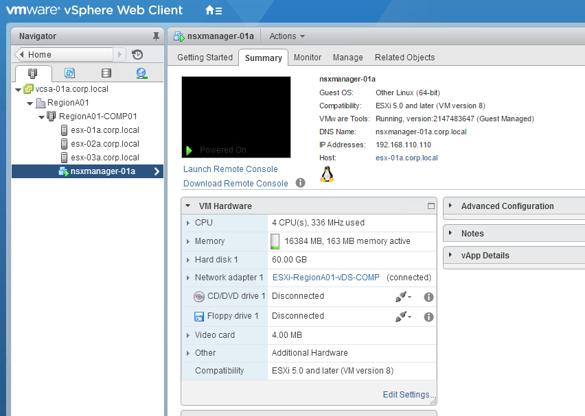
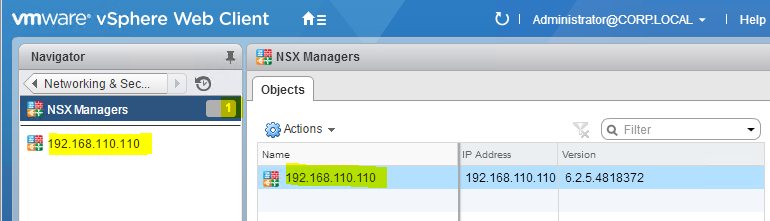

# Deploying NSX Manager with Ansible
Lab 2 provides instructions on using Ansible to deploy NSX Manager and register it with SSO and vCenter. To complete this section, you will need to provide your own licensed access to NSX Manager software. The reference lab and OneCloud vApps for this course use VMware-NSX-Manager-6.2.5-4818372. These instructions may also work with other versions of NSX Manager, however please note the lab materials in this course were developed and tested using only the versions of the software specified.

This Lab includes the following sections:

- [Prerequisites](https://github.com/afewell/AnsibleNSX101/tree/master/Lab2-NSXDeploy#prerequisites)
- [Deploy NSX Manager](https://github.com/afewell/AnsibleNSX101/tree/master/Lab2-NSXDeploy#deploy-nsx-manager)
- [Register NSX Manager with vCenter](https://github.com/afewell/AnsibleNSX101/tree/master/Lab2-NSXDeploy#register-nsx-manager-with-vcenter)
- [Register NSX Manger with vCenter Single Sign On](https://github.com/afewell/AnsibleNSX101/tree/master/Lab2-NSXDeploy#register-nsx-manager-with-the-single-sign-on-service)
- [Enter NSX License in vCenter]()

Please check the [NSX Ansible page on Github](https://github.com/vmware/nsxansible) for any updates to the NSX Ansible Modules. The lab materials in this course were developed and tested using only the versions of the software specified. 
## Prerequisites
- Prerequisites
  - __For OneCloud Users__
      - [Video - Loading the Ansible NSX vApps in OneCloud]()
      - If you load the vApp "AnsibleNSX_Prepped", this is the correct point to start with the lab exercises.
      - If you load the vApp "AnsibleNSX", you need to complete Lab-1d prior to starting this section
  - __For All Other Users__
    - Complete Lab 1
    - Make sure there is an A record in the DNS server for the FQDN you would like to use for the NSX Manager server.
    - Save NSX Manager OVA on the AnsibleCS Server home directory

## Deploy NSX Manager
### About the playbook
This section provides instructions to create and execute a playbook to deploy the NSX Manager virtual appliance. 
- The NSX Manager virtual appliance can be deployed with a single task, using the `nsx_deploy_ova` module. 
  - [Documentation for the nsx_deploy_ova module](https://github.com/vmware/nsxansible#module-nsx_deploy_ova)

### Create the playbook
  - Open a terminal session with the Ansible server 
      - Username: `vmware`
      - Password: `VMware1!`
    - The following commands create a new blank file called 'deploynsx.yml' and opens it in the vi text editor
    - `cd ~/nsxansible/`
    - `vi deployNsx.yml`
  - Edit the file to look like the example below:
    - Be sure to change any variables as needed for your environment
```
---
- hosts: localhost
  connection: local
  gather_facts: false
  vars_files:
    - answerfile.yml
  tasks:
  - name: deploy nsx-man
    nsx_deploy_ova:
      ovftool_path: '/usr/bin'
      datacenter: 'RegionA01'
      datastore: 'RegionA01-ISCSI01-COMP01'
      portgroup: 'ESXi-RegionA01-vDS-COMP'
      cluster: 'RegionA01-COMP01'
      vmname: 'nsxmanager-01a'
      hostname: 'nsxmanager-01a.corp.local'
      dns_server: '192.168.110.10'
      dns_domain: 'corp.local'
      ntp_server: '192.168.100.1'
      gateway: '192.168.110.1'
      ip_address: '192.168.110.110'
      netmask: '255.255.255.0'
      admin_password: 'VMware1!'
      enable_password: 'VMware1!'
      path_to_ova: '~/'
      ova_file: 'nsxmanager.ova'
      vcenter: 'vcsa-01a.corp.local'
      vcenter_user: 'administrator@corp.local'
      vcenter_passwd: 'VMware1!'
    register: deploy_nsx_man
```
  - __Note:__ Ansible playbooks are saved in the YAML format. YAML format does not understand tabs for indentation, so each level of indentation is seperated by 2 spaces, not tabs. YAML doesnt care if you use exactly 2 spaces or 3 spaces (etc...) to indent, but it does matter that the indentation is consistent and each line is indented just like in the above example. I use 2 spaces for each level of indentation, which is a good general practice.

### Run the playbook

- Return to your terminal session with the Ansible server 
  - `cd ~/nsxansible/`
  - `ansible-playbook -i hosts deployNsx.yml`
  - After you run the above command, it will take a long time to run (~10 minutes or more) as it will transfer the large NSX Manager OVA file from the AnsibleCS server to the vCenter datastore. While the play is running, there will be no output on the screen to indicate if the play is still running, so you just have to wait until you the play completes successfully or fails.  
  - After you run the play, while the play is running you should see output similar to the following:
```
vmware@vmware:~/nsxansible$ ansible-playbook -i hosts deploynsx.yml

PLAY ***************************************************************************

TASK [deploy nsx-man] **********************************************************
```

  - The screen should remain just like above until the play is finished running. 
  - Once the play is finished running, you should see output similar to the following:
```
vmware@vmware:~/nsxansible$ ansible-playbook -i hosts deploynsx.yml

PLAY ***************************************************************************

TASK [deploy nsx-man] **********************************************************
changed: [localhost]

PLAY RECAP *********************************************************************
localhost                  : ok=1    changed=1    unreachable=0    failed=0

vmware@vmware:~/nsxansible$ 
```
  - Ensure that when the play is completed, you see output similar to above, and the values under the "PLAY RECAP" section state "ok=1" and "changed=1", just like in the output above

### Verify results
- After the play runs successfully, open the vCenter web client and verify that the NSX Manager virtual machine has been deployed and powered on in your vCenter environment:



## Register NSX Manager with vCenter
### About the playbook
After deploying the NSX Manager virtual appliance, you must register it with vCenter.
- NSX Manager can be registered to vCenter with a single task, using the `nsx_vc_registration` module. 
  - __Note__ that in the playbook below, the local SSO root account administrator@vsphere.local is used to register NSX Manager. If you have set up your own lab you can use the SSO root account when registering NSX Manager, however typically in a production environment you would create a seperate service account to register NSX Manager. 
  - __Important:__ The account you use to register NSX Manager is the ONLY account that will initially have access to configure NSX Manager in the vSphere web client. After registration is complete your first vSphere web client login must be with the account used to register NSX Manager, which you can use to log in and give administration priviledges to other accounts as needed. 
  - [Documentation for the nsx_vc_registration module](https://github.com/vmware/nsxansible#module-nsx_vc_registration)

### Create the Playbook
- Create a playbook to register NSX Manager with vCenter
  - `cd ~/nsxansible/`
  - `vi registerNsxVcenter.yml`
  - Edit the file to look like the example below:
```
---
- hosts: localhost
  connection: local
  gather_facts: False
  vars_files:
    - answerfile.yml
  tasks:
  - name: NSX Manager VC Registration
    nsx_vc_registration:
      nsxmanager_spec: "{{ nsxmanager_spec }}"
      vcenter: 'vcsa-01a.corp.local'
      vcusername: 'administrator@vsphere.local'
      vcpassword: 'VMware1!'
      accept_all_certs: "True"
    register: register_to_vc

  - debug: var=register_to_vc
```
- In the above example file:
    - look at line for the variable nsxmanager_spec, notice that the value is "{{ nsxmanager_spec }}". 
    - Values like this that have the double curly brackets inside of quotes are how Ansible formats variables that are located in an external file.  The actual variables for nsxmanager_spec are in the 'answerfile.yml' file you created in Lab-1d. Notice that the above example lists the answerfile.yml as a vars_file - Ansible will look through all the files you list as vars_files to find values for any variables that use the double curly bracket format like the nsxmanager_spec in the example above.

### Run the playbook 
- Run  the play and review results
  - Return to your terminal session with the Ansible server
    - `cd ~/nsxansible`
    - `ansible-playbook -i hosts registerNsxVcenter.yml`
  - If the play completes successfully, you should see output similar to the following:
```
vmware@vmware:~/nsxansible$ ansible-playbook -i hosts registerNsxVcenter.yml

PLAY [localhost] ***************************************************************

TASK [NSX Manager VC Registration] *********************************************
changed: [localhost]

TASK [debug] *******************************************************************
ok: [localhost] => {
    "register_to_vc": {
        "argument_spec": {
            "accept_all_certs": "True",
            "nsxmanager_spec": {
                "host": "VALUE_SPECIFIED_IN_NO_LOG_PARAMETER",
                "password": "VALUE_SPECIFIED_IN_NO_LOG_PARAMETER",
                "raml_file": "VALUE_SPECIFIED_IN_NO_LOG_PARAMETER",
                "user": "VALUE_SPECIFIED_IN_NO_LOG_PARAMETER"
            },
            "vccertthumbprint": "25:CE:76:57:A1:C4:3B:56:06:68:2D:7D:9C:E1:5B:1E:E0:8E:53:74",
            "vcenter": "vcsa-01a.corp.local",
            "vcpassword": "VALUE_SPECIFIED_IN_NO_LOG_PARAMETER",
            "vcusername": "********istrator@vsphere.local"
        },
        "changed": true,
        "sso_config_response": {
            "Etag": null,
            "body": null,
            "location": null,
            "objectId": null,
            "status": 200
        }
    }
}

PLAY RECAP *********************************************************************
localhost                  : ok=2    changed=1    unreachable=0    failed=0
```

### Verify results

- From a computer that has connectivity to the IP address of NSX Manager, open a web browser to https://nsxmanager-01a.corp.local
  - Log in with the following credentials:
    - Username: admin
    - Password: VMware1!
  - Click on Manage vCenter Registration
    - Look for the "vCenter Server" section and verify that the "Status" is "Connected", similar to the image below


## Register NSX Manager with the Single Sign-on Service
### About the playbook
In addition to registering NSX Manager with vCenter, it must also be registered with the vCenter Single Sign On service.
- NSX Manager can be registered to vCenter Single Sign on with a single task, using the `nsx_sso_registration` module.
  - __Note__ that in the playbook below, the local SSO root account administrator@vsphere.local is used to register NSX Manager. If you have set up your own lab you can use the SSO root account when registering NSX Manager, however typically in a production environment you would create a seperate service account to register NSX Manager. 
  - __Important:__ The account you use to register NSX Manager is the ONLY account that will initially have access to configure NSX Manager in the vSphere web client. After registration is complete your first vSphere web client login must be with the account used to register NSX Manager, which you can use to log in and give administration priviledges to other accounts as needed.  
  - [Documentation for the nsx_sso_registration module](https://github.com/vmware/nsxansible#module-nsx_vc_registration)

### Create the playbook
- Create a playbook to register NSX Manager with SSO
  - `cd ~/nsxansible/`
  - `vi registerNsxSso.yml`
  - Edit the file to look like the example below:
```
---
- hosts: localhost
  connection: local
  gather_facts: False
  vars_files:
    - answerfile.yml
  tasks:
  - name: NSX Manager SSO Registration
    nsx_sso_registration:
      state: present
      nsxmanager_spec: "{{ nsxmanager_spec }}"
      sso_lookupservice_url: 'lookupservice/sdk'
      sso_lookupservice_port: 7444
      sso_lookupservice_server: 'vcsa-01a.corp.local'
      sso_admin_username: 'Administrator@vsphere.local'
      sso_admin_password: 'VMware1!'
      accept_all_certs: true
    register: register_to_sso

  - debug: var=register_to_sso
```
### Run the playbook
- Run  the play and review results
  - Return to your terminal session with the Ansible server
    - `cd ~/nsxansible`
    - `ansible-playbook -i hosts createControllers.yml`
  - Note: Once you run the play, Ansible will execute the tasks in order and display the status of each tasks. After the first 4 tasks complete successfully, the `Create NSX Controllers` task will take a long time (15 minutes or more) to run, during which time no output will be displayed. During this time you simply must wait, if the task fails, you will recieve an error message. 
  - If the play completes successfully, you should see output similar to the following:
    - Note: Your output may not look exactly like the output below, for example in developing this lab I sometimes have to run the same play multiple times before I get it working correctly which may create differences between the output below and what you see in your terminal. The only thing that really matters is that there are no errors when running the play. To verify this, in the `PLAY RECAP` section, make sure all tasks executed as `ok` or `changed`. The other values should be `unreachable=0` and `failed=0`, if any tasks are unreachable or failed, you need to troubleshoot until you can run the play with no errors before proceeding. 
```
vmware@vmware:~/nsxansible$ ansible-playbook -i hosts registersso.yml

PLAY ***************************************************************************

TASK [NSX Manager SSO Registration] ********************************************
changed: [localhost]

TASK [debug] *******************************************************************
ok: [localhost] => {
    "register_to_sso": {
        "argument_spec": {
            "accept_all_certs": true,
            "nsxmanager_spec": {
                "host": "VALUE_SPECIFIED_IN_NO_LOG_PARAMETER",
                "password": "VALUE_SPECIFIED_IN_NO_LOG_PARAMETER",
                "raml_file": "VALUE_SPECIFIED_IN_NO_LOG_PARAMETER",
                "user": "VALUE_SPECIFIED_IN_NO_LOG_PARAMETER"
            },
            "sso_admin_password": "VALUE_SPECIFIED_IN_NO_LOG_PARAMETER",
            "sso_admin_username": "Administrator@vsphere.local",
            "sso_certthumbprint": "FA:DA:47:9C:6B:B9:4C:6D:91:1F:84:17:2D:B7:66:1B:4D:BD:2A:49",
            "sso_lookupservice_port": 7444,
            "sso_lookupservice_server": "vcsa-01a.corp.local",
            "sso_lookupservice_url": "lookupservice/sdk",
            "state": "present"
        },
        "changed": true,
        "sso_config_response": {
            "Etag": null,
            "body": {
                "ssoConfigStatus": {
                    "message": "Done",
                    "status": "true"
                }
            },
            "location": null,
            "objectId": null,
            "status": 200
        }
    }
}

PLAY RECAP *********************************************************************
localhost                  : ok=2    changed=1    unreachable=0    failed=0

vmware@vmware:~/nsxansible$
```
- Note that the output from running this command is a bit long and contains some detailed information about the changes that were made. The reason for the detailed output is because if you look at the ssoregistration.yml playbook, look at the last 2 lines of the play:
    - `register: register_to_sso`
    - This command creates a variable array called "register-to-sso" which keeps a record of the actions done within the task
    - Next the entry `debug: var=register_to_sso` causes ansible to display the values in the "register_to_sso" array.

### Verify results
- __Important__ You must complete this verification section before proceeding to the next lab
- From a computer that has connectivity to the IP address of NSX Manager, open a web browser to https://nsxmanager-01a.corp.local
  - Log in with the following credentials:
    - Username: admin
    - Password: VMware1!
  - Click on Manage vCenter Registration
    - Look for the "Lookup Service URL" section and verify that the "Status" is "Connected", similar to the image below
    - 
  - If you have any browser connections open to vSphere web client, log out and close them now 
  - Observe that in the vCenter and SSO registration playbooks, you used the account 'administrator@vsphere.local' to register NSX Manager. You will now neeed to log into vSphere web client with the administrator@vsphere.local account, so that you can assign permissions for the administrator@corp.local account to manage NSX. 
    - Open a new web browser session with vSphere web client (https://vcsa-01a.corp.local/vsphere-client/?csp)
    - Log in with the following account:
      - Username: administrator@vsphere.local
      - Password: VMware1!
    - You should now be able to see a new "Networking & Security" section as shown in the below image:

    - Click on the "Networking & Security" tab
    - On the bottom of the left Navigator bar, click on "NSX Managers"
    - Click on the IP address of your NSX Manager
    - Click on the "Manage" tab
    - Click on the "Users" tab
    - Click on the green plus sign icon to add a new user
    - Enter the user administrator@corp.local and click next

    - Select "Enterprise Administrator" and click "Finish
    - You should now see the corp.local/administrator account listed as an Enterprise Administrator

    - Log out of the vSphere web client
    - Log back into the vSphere web client using the administrator@corp.local account
    - Click on the "Networking & Security" tab
    - On the bottom of the left Navigator bar, click on "NSX Managers"
    - Verify that you can see the NSX Manager listed, this confirms that the permissions setting worked as you would not be able to see the NSX Manager listed if your login account did not have correct permissions. 


## Enter NSX License in vCenter 
- Prior to proceeding, you must ensure you have entered a valid license for NSX. The current NSX Ansible modules do not support registering licenses via Ansible, so this section will walk you through entering the license through the vSphere web client. You must provide your own valid license key. VMware Employees can get a license throught the bobs-eval socialcast group. 
  - Open a web browser to the vSphere web client
  - Click on "Licensing"
  - Click the green plus sign icon to add a new license
  - Paste in your license key and complete the wizard to add license
  - Click on the "Assets" tab and then the "Solutions" tab
  - Highlight "NSX for vSphere" 
  - Under "All Actions" select "Assign License"
  - Select the correct NSX license, and click ok
  - The license should now be applied

### Congratulations, you have completed Lab 2!
## [Click Here To Proceed To Lab-3](../../Lab3-Discovery/)
