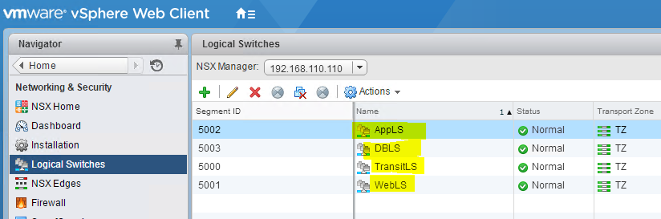
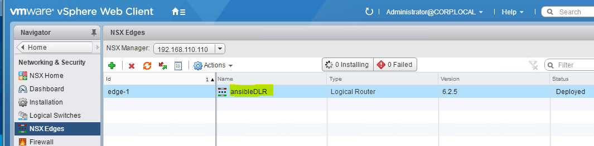
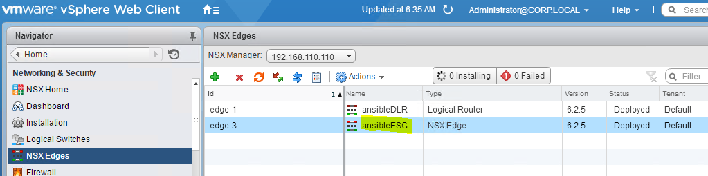
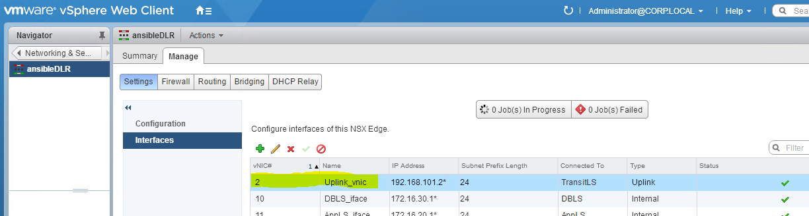
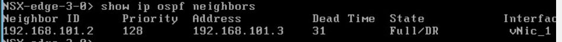
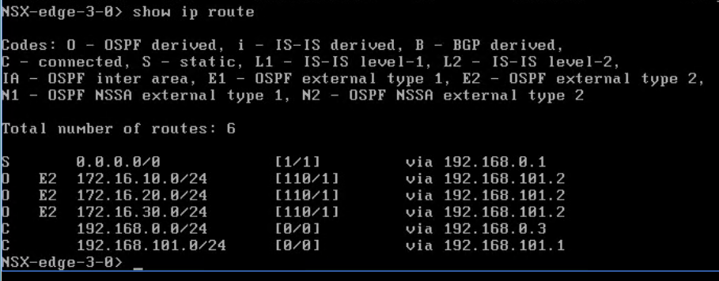

# Virtual Network Configuration
In the previous labs, you installed NSX Manager, registered it with vCenter and setup control and data plane components. NSX is now ready to start providing virtual network & security services. This section covers the configuration and provisioning of edge routing, distributed routing and logical switching. 

This Lab includes the following sections:

- [Lab Topology Review](https://github.com/afewell/AnsibleNSX101/tree/master/Lab4-Virtual%20Network%20Configuration#lab-4-virtual-networking-topology)
- [Logical Switching](https://github.com/afewell/AnsibleNSX101/tree/master/Lab4-Virtual%20Network%20Configuration#logical-switching)
- [Distributed Router Deployment](https://github.com/afewell/AnsibleNSX101/tree/master/Lab4-Virtual%20Network%20Configuration#distributed-routing)
- [Edge Router Deployment](https://github.com/afewell/AnsibleNSX101/tree/master/Lab4-Virtual%20Network%20Configuration#edge-routing)
- [Dynamic Routing Configuration]()


## Virtual Network Topology

This lab will go through each of the NSX Ansible Networking configuration modules. Completion of all of the exercises in Lab 4 will result in the following virtual network topology:

 

## Logical Switching
In this section, you will make a playbook to create each of the logical switches required to complete the Lab 4 Virtual Networking Topology. 

### About the playbook
- An NSX Logical switch can be created with a single task
    - The playbook you create in this section will use 4 copies of the same task to create 4 logical switches, TransitLS, WebLS, AppLS and DBLS. 
    - [Documentation for the nsx_logical_switch module](https://github.com/vmware/nsxansible#module-nsx_deploy_ova)

### Create the Playbook
- An NSX Logical switch can be created with a single task
    - The playbook you create in this section will use 4 copies of the same task to create 4 logical switches, TransitLS, WebLS, AppLS and DBLS. 
- Create the playbook
  - Return to your terminal session with the Ansible server
  - `cd ~/nsxansible`
  - `vi createLs.yml`
  - Edit the file to look like the following:
```
---
- hosts: localhost
  connection: local
  gather_facts: False
  vars_files:
     - answerfile.yml
  tasks:
  - name: Create logical switch 
    nsx_logical_switch:
      nsxmanager_spec: "{{ nsxmanager_spec }}"
      state: present
      transportzone: "TZ"
      name: "TransitLS"
      controlplanemode: "UNICAST_MODE"
      description: "Transit LS"
    register: create_logical_switch

  - name: Create logical switch 
    nsx_logical_switch:
      nsxmanager_spec: "{{ nsxmanager_spec }}"
      state: present
      transportzone: "TZ"
      name: "WebLS"
      controlplanemode: "UNICAST_MODE"
      description: "Web Tier LS"
    register: create_logical_switch

  - name: Create logical switch 
    nsx_logical_switch:
      nsxmanager_spec: "{{ nsxmanager_spec }}"
      state: present
      transportzone: "TZ"
      name: "AppLS"
      controlplanemode: "UNICAST_MODE"
      description: "App Tier LS"
    register: create_logical_switch

  - name: Create logical switch 
    nsx_logical_switch:
      nsxmanager_spec: "{{ nsxmanager_spec }}"
      state: present
      transportzone: "TZ"
      name: "DBLS"
      controlplanemode: "UNICAST_MODE"
      description: "DB Tier LS"
    register: create_logical_switch
```

### Run the Playbook
- Return to your terminal session with the Ansible server 
  - `cd ~/nsxansible/`
  - `ansible-playbook -i hosts createLs.yml`
- If the play completes successfully, you should see output similar to the following:
```
vmware@vmware:~/nsxansible$ ansible-playbook -i hosts createLs.yml

PLAY [localhost] ***************************************************************

TASK [Create logical switch] ***************************************************
changed: [localhost]

TASK [Create logical switch] ***************************************************
changed: [localhost]

TASK [Create logical switch] ***************************************************
changed: [localhost]

TASK [Create logical switch] ***************************************************
changed: [localhost]

PLAY RECAP *********************************************************************
localhost                  : ok=4    changed=4    unreachable=0    failed=0

```

### Validate Results
- Open a browser connection to the vCenter web client home page
  - Click on the `Networking & Security` tab
  - Click on "Logical Switches" in the left Navigator bar 
  - You should see each of the 4 logical switches that were created with the createLs.yml play, as in the image below


## Distributed Routing

Now that you have created the logical switches for the lab environment, you will need to implement routing services to enable IP connectivity between the logical switch subnets. In this section you will create a playbook to install and configure distributing routing services. 
### About the playbook
In this section you will prepare and execute a playbook that will create and provide the basic configuration for an NSX Distributed Logical Router (DLR). This DLR will serve as the default gateway for virtual machines connected to the WebLS, AppLS and DBLS Logical Switches that you created in the previous section on [Logical Switching](). The DLR will also connect to the TransitLS Logical Switch created in the previous section, and it will use the TransitLS network to connect to an NSX Edge Services Gateway you will create in the next section. 

- About the playbook
    - Tasks 1-3: Gather vCenter Moids
      - Description: 
        - Before you can deploy a DLR with the `nsx-dlr` ansible module, you first need to gather the MOIDs for the resource pool or cluster, datacenter, datastore and management portgroup.  
      - [Documentation for the vcenter_gather_moids module](https://github.com/vmware/nsxansible#module-vcenter_gather_moids)
    - Task 4: DLR Creation
      - Description:
        - This task provides the needed values to create the DLR and provide the base IP configuration including interface configuration
      - [Documentation for the nsx_dlr module](https://github.com/vmware/nsxansible#module-nsx_dlr)

### Create The Playbook
- Create the playbook
  - Return to your terminal session with the Ansible server
  - `cd ~/nsxansible`
  - `vi createDlr.yml`
  - Edit the file to look like the following:
```
---
- hosts: localhost
  connection: local
  gather_facts: False
  vars_files:
     - answerfile.yml
  tasks:
  - name: Gather vCenter Cluster moid
    vcenter_gather_moids:
      hostname: 'vcsa-01a.corp.local'
      username: 'administrator@corp.local'
      password: 'VMware1!'
      datacenter_name: 'RegionA01'
      cluster_name: 'RegionA01-COMP01'
      validate_certs: False
    register: vcenter_cluster_moid

  - name: Gather vCenter management datastore moid
    vcenter_gather_moids:
      hostname: 'vcsa-01a.corp.local'
      username: 'administrator@corp.local'
      password: 'VMware1!'
      datacenter_name: 'RegionA01'
      datastore_name: 'RegionA01-ISCSI01-COMP01'
      validate_certs: False
    register: vcenter_datastore_moid

  - name: Gather vCenter management portgroup moid
    vcenter_gather_moids:
      hostname: 'vcsa-01a.corp.local'
      username: 'administrator@corp.local'
      password: 'VMware1!'
      datacenter_name: 'RegionA01'
      portgroup_name: 'ESXi-RegionA01-vDS-COMP'
      validate_certs: False
    register: vcenter_portgroup_moid

  - name: DLR creation
    nsx_dlr:
      nsxmanager_spec: "{{ nsxmanager_spec }}"
      state: present
      name: 'ansibleDLR'
      description: 'This DLR is created by nsxansible'
      resourcepool_moid: "{{ vcenter_cluster_moid.object_id }}"
      datastore_moid: "{{ vcenter_datastore_moid.object_id }}"
      datacenter_moid: "{{ vcenter_cluster_moid.datacenter_moid }}"
      mgmt_portgroup_moid: "{{ vcenter_portgroup_moid.object_id }}"
      interfaces:
        - {name: 'Uplink_vnic', ip: '192.168.101.4', prefix_len: 24, logical_switch: 'TransitLS', iftype: 'uplink'}
        - {name: 'WebLS_iface', ip: '172.16.10.1', prefix_len: 24, logical_switch: 'WebLS', iftype: 'internal'}
        - {name: 'AppLS_iface', ip: '172.16.20.1', prefix_len: 24, logical_switch: 'AppLS', iftype: 'internal'}
        - {name: 'DBLS_iface', ip: '172.16.30.1', prefix_len: 24, logical_switch: 'DBLS', iftype: 'internal'}
      default_gateway: '192.168.101.1'
      remote_access: 'true'
      username: 'admin'
      password: 'VMware1!VMware1!'
      ha_enabled: 'false'
    register: create_dlr

```

### Run the Playbook
- Run  the play and review results
  - Return to your terminal session with the Ansible server
    - `cd ~/nsxansible`
    - `ansible-playbook -i hosts createDlr.yml`
- If the play completes successfully, you should see output similar to the following:
```
vmware@vmware:~/nsxansible$ ansible-playbook -i hosts createDlr.yml

PLAY [localhost] ***************************************************************

TASK [Gather vCenter Cluster moid] *********************************************
ok: [localhost]

TASK [Gather vCenter management datastore moid] ********************************
ok: [localhost]

TASK [Gather vCenter management portgroup moid] ********************************
ok: [localhost]

TASK [DLR creation] ************************************************************
changed: [localhost]

PLAY RECAP *********************************************************************
localhost                  : ok=4    changed=1    unreachable=0    failed=0

```

### Validate Results
- Open a browser connection to the vCenter web client home page
  - Click on the `Networking & Security` tab
  - Click on "NSX Edges" in the left Navigator bar 
  - You should see the "ansibleDLR" router that was created with the createDlr.yml play, as in the image below


## Edge Routing

Now that you have created the logical switches for the lab environment, and a logical router to provide first-hop and east-west routing services, you will next create an edge services gateway and configure it to provide north-south routing services to serve as a gateway for traffic flows that go between the virtual and physical routing environments. 

### About the playbook
In this section you will create and provide the basic configuration for an NSX Edge Services Gateway (ESG). This ESG will serve as a gateway between the virtual and physical routing environments. 

- The installation and configuration of the ESG requires several tasks that interact with multiple NSX Ansible modules. 
    - Tasks 1-3: Gather vCenter Moids
      - Description: 
        - Before you can deploy a DLR with the `nsx-dlr` ansible module, you first need to gather the MOIDs for the resource pool or cluster, datacenter, datastore and management portgroup.  
      - [Documentation for the vcenter_gather_moids module](https://github.com/vmware/nsxansible#module-vcenter_gather_moids)
    - Task 2: ESG Creation
      - Description:
        - This task provides the needed values to create the ESG and provide the base IP configuration including interface configuration
      - [Documentation for the nsx_edge_router module](https://github.com/vmware/nsxansible#module-nsx_edge_router)
      
### Create The Playbook
- Create the playbook
  - Return to your terminal session with the Ansible server
  - `cd ~/nsxansible`
  - `vi createEsg.yml`
  - Edit the file to look like the following:
```
---
- hosts: localhost
  connection: local
  gather_facts: False
  vars_files:
     - answerfile.yml
  tasks:
  - name: Gather vCenter Cluster moid
    vcenter_gather_moids:
      hostname: 'vcsa-01a.corp.local'
      username: 'administrator@corp.local'
      password: 'VMware1!'
      datacenter_name: 'RegionA01'
      cluster_name: 'RegionA01-COMP01'
      validate_certs: False
    register: vcenter_cluster_moid

  - name: Gather vCenter management datastore moid
    vcenter_gather_moids:
      hostname: 'vcsa-01a.corp.local'
      username: 'administrator@corp.local'
      password: 'VMware1!'
      datacenter_name: 'RegionA01'
      datastore_name: 'RegionA01-ISCSI01-COMP01'
      validate_certs: False
    register: vcenter_datastore_moid

  - name: Gather vCenter management portgroup moid
    vcenter_gather_moids:
      hostname: 'vcsa-01a.corp.local'
      username: 'administrator@corp.local'
      password: 'VMware1!'
      datacenter_name: 'RegionA01'
      portgroup_name: 'ESXi-RegionA01-vDS-COMP'
      validate_certs: False
    register: vcenter_portgroup_moid

  - name: ESG creation
    nsx_edge_router:
      nsxmanager_spec: "{{ nsxmanager_spec }}"
      state: present
      name: 'ansibleESG'
      description: 'This ESG was created by nsxansible'
      appliance_size: 'compact'
      resourcepool_moid: "{{ vcenter_cluster_moid.object_id }}"
      datastore_moid: "{{ vcenter_datastore_moid.object_id }}"
      datacenter_moid: "{{ vcenter_cluster_moid.datacenter_moid }}"
      interfaces:
        vnic0: {ip: '192.168.0.3', prefix_len: 24, portgroup_id: "{{ vcenter_portgroup_moid.object_id }}", name: 'Uplink vnic', iftype: 'uplink'}
        vnic1: {ip: '192.168.101.1', prefix_len: 24, logical_switch: 'TransitLS', name: 'Internal vnic', iftype: 'internal'}
      default_gateway: '192.168.0.1'
      remote_access: 'true'
      username: 'admin'
      password: 'VMware1!VMware1!'
      firewall: 'false'
      ha_enabled: 'false'
    register: create_esg
```

### Run the Playbook
- Run  the play and review results
  - Return to your terminal session with the Ansible server
    - `cd ~/nsxansible`
    - `ansible-playbook -i hosts createEsg.yml`
- If the play completes successfully, you should see output similar to the following:
```
vmware@vmware:~/nsxansible$ ansible-playbook -i hosts createEsg.yml

PLAY [localhost] ***************************************************************

TASK [Gather vCenter Cluster moid] *********************************************
ok: [localhost]

TASK [Gather vCenter management datastore moid] ********************************
ok: [localhost]

TASK [Gather vCenter management portgroup moid] ********************************
ok: [localhost]

TASK [ESG creation] ************************************************************
changed: [localhost]

PLAY RECAP *********************************************************************
localhost                  : ok=4    changed=1    unreachable=0    failed=0

```

### Validate Results
- Open a browser connection to the vCenter web client home page
  - Click on the `Networking & Security` tab
  - Click on "NSX Edges" in the left Navigator bar 
  - You should see the "ansibleESG" router that was created with the createEsg.yml play, as in the image below

  - Navigate to the vSphere web client home page
  - Click on "Hosts & Clusters"
  - Right click on the "ansibleESG-0" vm and select "open console"
  - Log into the ESG with the following credentials:
    - Username: admin
    - Password: VMware1!VMware1!
  - Ping the DLR (192.168.101.2) to verify IP connectivity

## Dynamic Routing
Now that you have created the logical switches for the lab environment and installed routers, you need to enable dynamic routing to allow the routers to learn new routes from adjacent routers. 

### About the playbook
In this section you will prepare and execute a playbook that will configure OSPF routing on both the ESG & DLR Routers. The DLR will be configured to redistributed its directly connected networks (TransitLS, WebLS, AppLS and DBLS networks) into OSPF. The ESG will be configured to peer with the DLR and learn routes to the Logical Switch subnets. 

The ESG will also be configured to peer with another Northbound router (vpod_router) that is present in the OneCloud environment to provide external connectivity. If you are not a onecloud user, instructions for setting up a vpod router equivalent are not provided, but feel free to use any physical or virtual OSPF capable router. You also do not need to replicate any excercises or configuration steps related to vpod_router as there are no significant ongoing dependencies on it. 

- About the Playbook
    - Task 1: Configure OSPF DLR
      - __Important__ you may need to modify the playbook below with the vnic number of the DLR's "Upink_vnic". 
        - Open a connection to the vSphere web client
        - Click on "Networking & Security"
        - Click on "NSX Edges"
        - Double click on "ansibleDLR"
        - Under Settings > Interfaces, identify the vNIC # of the "Uplink_vnic". For example Uplink_vnic uses vNIC #2 in the image below
  
        - Observe in the plabook below under the 'Configure OSPF DLR' task, the line "{ area_id: 0, vnic: 2 }"
        - If your Uplink_vnic number is 2, you do not need to change this setting, but if you have a different vnic number, be sure to change this value in the playbook to your vnic number before running it.
      - Description: 
        - This task configures OSPF on the DLR created earlier in this lab 
      - [Documentation for the nsx_ospf module](https://github.com/vmware/nsxansible#module-nsx_ospf)
    - Task 2: Configure OSPF ESG
      - Description:
        - This task configures OSPF on the ESG created earlier in this lab
      - [Documentation for the nsx_ospf module](https://github.com/vmware/nsxansible#module-nsx_ospf)
    - Task 3: Configure OSPF Redistribution
      - Description:
        - The NSX Ansible Modules use a seperate module to configure route redistribution settings from the routing protocol configuration. This task will be used to enable automatic redistribution of directly connected interfaces into OSPF advertisements generated by the DLR. 
      - [Documentation for the nsx_redistribution module](https://github.com/vmware/nsxansible#module-nsx_redistribution)

### Create The Playbook
- Create the playbook
  - Return to your terminal session with the Ansible server
  - `cd ~/nsxansible`
  - `vi setupOspf.yml`
  - Edit the file to look like the following:
```
---
- hosts: localhost
  connection: local
  gather_facts: False
  vars_files:
     - answerfile.yml
  tasks:
  - name: Configure OSPF DLR
    nsx_ospf:
      nsxmanager_spec: "{{ nsxmanager_spec }}"
      state: present
      edge_name: 'ansibleDLR'
      router_id: '192.168.101.2'
      default_originate: False
      forwarding_address: '192.168.101.2'
      protocol_address: '192.168.101.3'
      areas:
        - { area_id: 0 }
      area_map:
        - { area_id: 0, vnic: 2 }          
    register: ospf_dlr

  - name: Configure OSPF esg
    nsx_ospf:
      nsxmanager_spec: "{{ nsxmanager_spec }}"
      state: present
      edge_name: 'ansibleESG'
      router_id: '192.168.0.3'
      default_originate: true
      areas:
        - { area_id: 0 }
      area_map:
        - { area_id: 0, vnic: 0 } 
        - { area_id: 0, vnic: 1 }          
    register: ospf_esg

  - name: Configure OSPF Redistribution
    nsx_redistribution:
      ospf_state: present
      bgp_state: absent
      nsxmanager_spec: "{{ nsxmanager_spec }}"
      edge_name: 'ansibleDLR'
      rules:
        - {learner: 'ospf', priority: 0, static: false, connected: true, bgp: false, ospf: false, action: 'permit'}
    register: redist 
```

### Run the Playbook

- If the play completes successfully, you should see output similar to the following:
```
vmware@vmware:~/nsxansible$ ansible-playbook -i hosts setupOspf.yml

PLAY [localhost] ***************************************************************

TASK [Configure OSPF DLR] ******************************************************
changed: [localhost]

TASK [Configure OSPF esg] ******************************************************
changed: [localhost]

TASK [Configure OSPF Redistribution] *******************************************
changed: [localhost]

PLAY RECAP *********************************************************************
localhost                  : ok=3    changed=3    unreachable=0    failed=0

```

### Validate Results
- Navigate to the vSphere web client home page
  - Click on "Hosts & Clusters"
  - Right click on the "ansibleESG-0" vm and select "open console"
  - Log into the ESG with the following credentials:
    - Username: admin
    - Password: VMware1!VMware1!
  - Enter `show ip ospf neighbors`
    - You should see the DLR Listed as a neighbor as in the image below

  - Enter `show ip route`
    - You should see three OSPF External type 2 routes for the 172.16.10.0/24, 172.16.20.0/24 and 172.16.30.0/24 listed as in the image below. This verifies both that OSPF is working on the ESG and DLR routers, and that the DLR is redistributing its directly connected networks into OSPF. 


### Congratulations, you have completed Lab 4!
## [You have reached the end of this course. Please visit the course homepage to check for updates!](../)